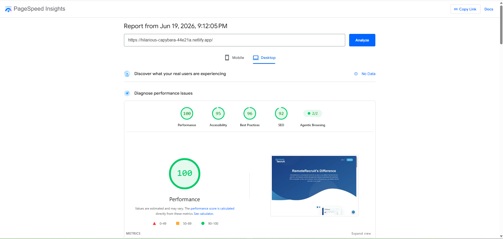
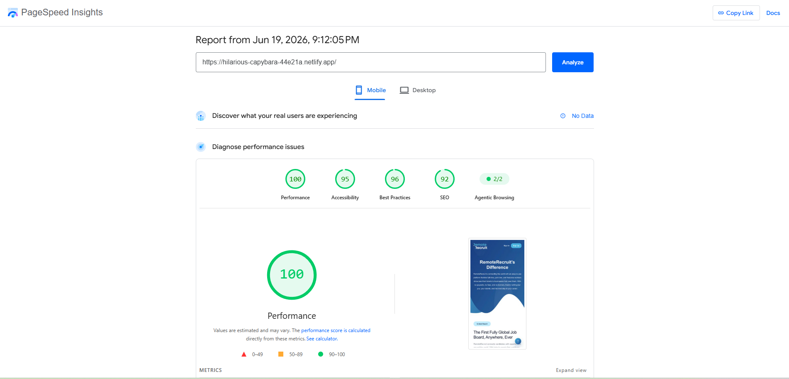
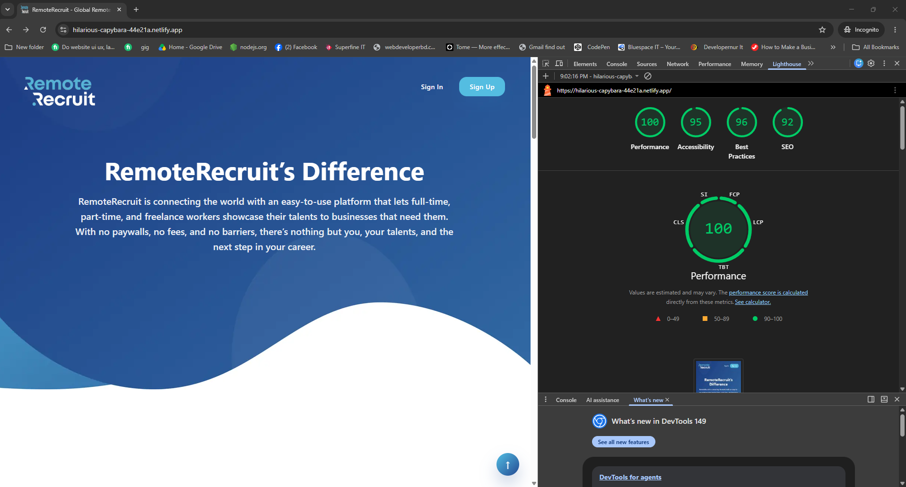

# RemoteRecruit - Features Landing Page

React 19.2.7 + Tailwind CSS implementation of the RemoteRecruit features landing page.

## Tech Stack

- React.js 19.2.7
- Vite
- Tailwind CSS
- Component-based architecture

## Features

- Responsive desktop, tablet, and mobile layout with mobile CTA fix
- Tailwind-only styling
- Reusable components for header, hero, feature blocks, CTA, FAQ, pricing, and footer
- Smooth scroll-triggered section reveal animations
- Hover states and transitions
- Mock FAQ data
- Scroll-to-top button
- Optimized WebP images with lazy loading
- Production-ready Vite build

## Setup

```bash
npm install --legacy-peer-deps
npm run dev
```

## Production build

For Lighthouse/performance testing, do **not** test the Vite development server. Use the production build:

```bash
npm run build
npm run preview
```

Then test the preview URL in Chrome Incognito mode with extensions disabled.

## Known notes

Chrome extensions and browser profile storage can affect Lighthouse performance scores. Use Incognito mode or a clean Chrome profile for the final audit.

## Project Screenshots

### Desktop View



### Mobile View



### Lighthouse Score


